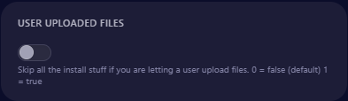

[](https://postimg.cc/ppVxYg8h)
# How to Set Up the Template Bot on Cybrancee Using GitHub 

## Step-by-Step Instructions

### 1. Log into the Cybrancee Panel and *Head over to the Startup page*
   - Go to [Cybrancee Panel](https://panel.cybrancee.com/) and log into your account.

### 2. Clone the GitHub Repository
   - **GIT REPO ADDRESS**: 
     - Enter the GitHub repository link.
     - Repo Link: `https://github.com/Cybrancee/Discord-JS-MongoDB-Template`
     - **Description**: This is the GitHub repository to clone.

<a href="https://github.com/Cybrancee/Discord-JS-MongoDB-Template">
   
</a>

### 3. Select the Install Branch
   - **INSTALL BRANCH**: 
     - Enter `main`.
     - **Description**: The branch of the bot to install.

<a href="https://github.com/Cybrancee/Discord-JS-MongoDB-Template">
   
</a>

### 4. User Uploaded Files
   - **USER UPLOADED FILES**: 
     - Disable to skip all the install stuff. 
     - **Description**: Skip all the install stuff if you are letting a user upload files. `0 = false` (default), `1 = true`.

<a href="https://github.com/Cybrancee/Discord-JS-MongoDB-Template">
   
</a>

### 5. Auto Update
   - **AUTO UPDATE**: 
     - Enable or disable based on your preference.
     - **Description**: Pull the latest files on startup when using a GitHub repo.
   *Note: After manually changing the code in the panel - updates made on the original repository will be blocked.*

<a href="https://github.com/Cybrancee/Discord-JS-MongoDB-Template">
   
</a>

### 6. Specify the Bot Entry Point
   - **BOT JS FILE**: 
     - Enter `src/index.js`.
     - **Description**: The file that starts the bot.

<a href="https://github.com/Cybrancee/Discord-JS-MongoDB-Template">
   
</a>

### 7. Install Additional Node Packages
   - **ADDITIONAL NODE PACKAGES**: 
     - Enter `discord.js axios discord-logs mongodb mongoose@6.0.2 dotenv canvas @napi-rs/canvas os discord-gamecord dotenv`.
     - **Description**: Install additional node packages. Use spaces to separate.

<a href="https://github.com/Cybrancee/Discord-JS-MongoDB-Template">
   
</a>

### 8. GitHub Authentication
   - **GIT USERNAME**: 
     - Enter `Cybrancee` as the GitHub username.
     - **Description**: Username to authenticate with Git.
<a href="https://github.com/Cybrancee/Discord-JS-MongoDB-Template">
   
</a>

   - **GIT ACCESS TOKEN** `(Not needed)`: 
     - Enter your GitHub Personal Access Token if you are using it out of a own private repository.
     - **Description**: Password to use with Git but with a private repository. It's best practice to use a Personal Access Token. [Create a GitHub Personal Access Token](https://github.com/settings/tokens).

<a href="https://github.com/Cybrancee/Discord-JS-MongoDB-Template">
   
</a>

### 9. Uninstall Node Packages
   - **UNINSTALL NODE PACKAGES**: 
     - Leave this field empty or enter the packages you want to uninstall.
     - **Description**: Uninstall node packages. Use spaces to separate.

<a href="https://github.com/Cybrancee/Discord-JS-MongoDB-Template">
   
</a>

## MongoDB Setup Instructions

### Step 1: Follow our Cybrancee MongoDB Guide
   - Go to [Cybrancee MongoDB Guide](https://cybrancee.com/blog) and follow the prompts to set up a new cluster.

### Step 2: Update Your .env file
   - Edit your Discord Bot Token and MongoDB URL in the `.env` file:
     ```env
     token=your_discord_bot_token
     MONGODBURI=your_mongodb_connection_string
     ```

## Need support for setting up your bot?
  - Feel free to join the [Cybrancee Server](https://discord.gg/8V6S7H4FDU).
